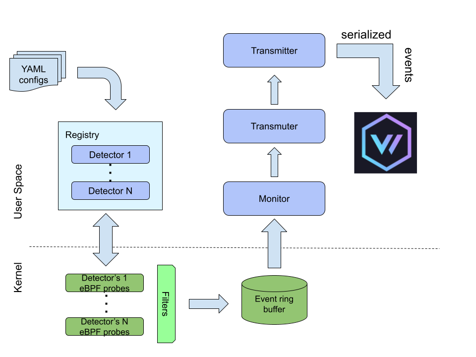

## Overview

Let's look at some design concepts.

### Detector

Detector provides a common interface for loading eBPF programs, initializing
maps and attaching programs to hook points. All detector programs are viewed
externally as a single entity that delivers events. EBPF part of detectors is
located
[here](https://github.com/anfedotoff/bombini/tree/main/bombini-detectors-ebpf/src/bin).
User mode part is
[here](https://github.com/anfedotoff/bombini/tree/main/bombini/src/detector). Detectors
also can provide information not only for user but for other detectors storing it
in maps. Some parts of the detectors can be reused across different detectors.
Detectors submit events to user space using ring buffer. Detectors use YAML
config files for initialization.

### Filters

Filters are applied to eBPF events in order to decide will be event exposed to user space or not.
A detailed description of the filtering can be found directly in the description of the corresponding detector.

### Monitor

Monitor observes new low level events (messages) and extracts them from ring buffer.

### Transmuter

Transmuter converts (transmutes) low kernel event into serializable (json, for
example) data structure. It also can enrich kernel event with some user mode
data.

### Transmitter

Transmitter sends serialized events (byte arrays) to different sources (unix socket, stdout, file, etc).

### Config

Config holds global agent configuration. It also have list of the detectors to
load during start up. Some detectors may have thier own configs.

### Registry

Registry stores loaded detectors. It can load/unload detectors and possibly
interact with them (change config maps).

## List of the Detectors

* [procmon](detectors/procmon.md)
* [filemon](detectors/filemon.md)
* [netmon](detectors/netmon.md)
* [gtflobins](detectors/gtfobins.md)
* [histfile](detectors/histfile.md)
* [io_uring](detectors/io_uring.md)
